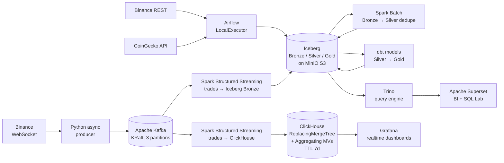

# Real-Time Crypto Analytics Platform

A production-style data platform that ingests live Binance trades and batch market snapshots, processes them through a Lambda architecture (hot + cold paths), and serves both sub-second dashboards and historical analytics. Built end-to-end on a single laptop with Docker Compose — every layer you would expect in a real fintech data stack is present and wired together.

      

---

## Why this project

Most portfolio pipelines stop at "Kafka → ETL → Postgres". The goal here was different:

- **Two read patterns, two stores.** A trading dashboard needs prices in under a second. A P&L report or ML feature backfill needs months of clean history. One store cannot optimize for both — so this project runs them side by side and explains the tradeoff.
- **Production patterns, not a buzzword tour.** Idempotent producers, exactly-once-ish via at-least-once + dedup keys, Iceberg medallion on object storage, a real Hive Metastore (not the shortcut REST catalog), dbt over Trino, Airflow with `LocalExecutor`. Each choice is documented with tradeoffs in [`docs/adr/`](docs/adr).
- **Runs on one machine.** Fourteen containers, ~7 GB RAM with all profiles up. Compose profiles (`foundation` / `streaming` / `batch` / `serving`) let you bring up just the slice you need.

---

## Architecture



### Two pipelines, one event stream

| | Hot path | Cold path |
|---|---|---|
| **Latency** | ~10 seconds end-to-end | ~30 seconds to Bronze, minutes to Gold |
| **Retention** | 7 days (ClickHouse TTL) | Unlimited (object storage) |
| **Read pattern** | Sub-second aggregations for dashboards | Full-history OLAP, ML feature extraction |
| **Storage engine** | `ReplacingMergeTree` + `AggregatingMergeTree` materialized views | Iceberg on MinIO with Hive Metastore catalog |
| **Dedup** | Primary key `(symbol, trade_id)` + background merge | `row_number()` window in Silver batch job |
| **Query surface** | Grafana dashboards on ClickHouse | Trino on Iceberg, exposed to Superset and dbt |

Both pipelines consume **the same Kafka topic** with **independent checkpoints**. A failure in the hot path does not corrupt the cold path — a core property of Lambda architecture (see [`docs/adr/003-why-lambda-not-kappa.md`](docs/adr/003-why-lambda-not-kappa.md)).

---

## Data flow

### 1. Ingestion

- [**Binance WebSocket producer**](producers/binance_ws_producer/) — Python asyncio service that subscribes to a combined `@trade` stream for 5 symbols (BTC, ETH, SOL, BNB, XRP) over a single connection, normalizes Binance's short field names into an internal schema ([`schema.py`](producers/binance_ws_producer/schema.py)), and publishes to Kafka with key `"<SYMBOL>:<TRADE_ID>"`. Keyed produce pins each symbol to a single partition, preserving per-symbol ordering for downstream consumers. Uses `enable_idempotence=True`, `acks="all"`, gzip compression, and exponential backoff reconnect.
- [**Airflow DAGs**](airflow/dags/) — `LocalExecutor` runs two DAGs: `binance_klines_backfill` (daily, 1h OHLCV to Bronze parquet) and `coingecko_snapshot` (hourly, top 250 coins by market cap). Idempotent via deterministic S3 paths templated with `{{ ds }}` and `{{ ts_nodash }}`.

### 2. Stream processing

Two Spark Structured Streaming jobs, each deployed as its own container running `spark-submit` in client mode:

- [**`trades_to_clickhouse.py`**](spark_jobs/streaming/trades_to_clickhouse.py) — 10-second micro-batches, JDBC sink via `foreachBatch` (no native Spark → ClickHouse streaming sink exists at the time of writing; the idiomatic workaround is to drop to batch API per micro-batch). `isolationLevel=NONE` is required because ClickHouse has no transaction protocol. At-least-once + ClickHouse's `ReplacingMergeTree` dedup on `(symbol, trade_id)` gives effective exactly-once semantics for this sink.
- [**`trades_to_iceberg.py`**](spark_jobs/streaming/trades_to_iceberg.py) — 30-second micro-batches, native Iceberg streaming sink. Atomic commits through the Iceberg transaction log give true exactly-once writes. Partitioned by `(symbol, days(kafka_timestamp))` for partition pruning on symbol-scoped queries.

Checkpoints live on MinIO at `s3a://checkpoints/<job>/`. Restarts resume from the last committed offset; stopping and starting the container is safe and lossless.

### 3. Batch processing

- [**`bronze_to_silver_trades.py`**](spark_jobs/batch/bronze_to_silver_trades.py) — deduplicates Bronze using a `row_number()` window keyed on `(symbol, trade_id)` ordered by `kafka_timestamp DESC`, keeping the latest replica of any duplicates. Writes to `iceberg.silver.trades` partitioned by symbol.
- [**dbt models**](dbt/models/) — `stg_trades` (view over Silver) and `fact_trades_1h` (1h OHLCV rollup into `iceberg.gold.*`). Profile targets Trino; materializations match the medallion layer.

### 4. Serving

- **Grafana** reads from ClickHouse for sub-second dashboards. Datasources and a `trades_realtime` dashboard are auto-provisioned on container start.
- **Trino** exposes Iceberg to SQL clients (Superset, dbt, DBeaver). Uses the native S3 filesystem (Trino 450+) — no hadoop-aws needed.
- **Superset** connects to both Trino (for Iceberg) and ClickHouse (hot + cold in one BI tool).

---

## Stack

| Layer | Tool | Version | Notes |
|---|---|---|---|
| Message bus | Apache Kafka | 3.8 (KRaft) | No ZooKeeper. 3 partitions, 24h retention. |
| Object storage | MinIO | RELEASE.2024-10-13 | S3-compatible, 5 buckets (bronze, silver, gold, checkpoints, warehouse). |
| Table format | Apache Iceberg | 1.6.1 | Format v2, zstd parquet. |
| Metastore | Hive Metastore (standalone) | 3.1.3 | On Postgres. Chosen over REST catalog for production realism. |
| Stream + batch | Apache Spark | 3.5.3 | Standalone cluster (1 master + 1 worker). Custom image bakes Iceberg, Kafka, S3A, ClickHouse JDBC jars. |
| SQL transform | dbt-core + dbt-trino | 1.8 | Staging + marts over Trino. |
| OLAP (hot) | ClickHouse | 24.8 | `ReplacingMergeTree` + `AggregatingMergeTree` MVs. |
| Query engine | Trino | 464 | Iceberg connector via HMS Thrift, native S3 filesystem. |
| Orchestration | Apache Airflow | 2.10.3 | `LocalExecutor`, Postgres backend. |
| BI | Apache Superset | 4.0.2 | Trino + ClickHouse SQLAlchemy drivers. |
| Real-time dashboard | Grafana | 11.3 | Auto-provisioned ClickHouse datasource. |
| Metadata RDBMS | Postgres | 15 | Shared by Hive, Airflow, Superset (saves ~800 MB RAM vs three instances). |

---

## Key design decisions

Full ADRs under [`docs/adr/`](docs/adr). Headlines:

- **[Lambda over Kappa](docs/adr/003-why-lambda-not-kappa.md)** — dual sinks optimized per read pattern. Cost: schema declared in three places; benefit: hot-path outage cannot corrupt cold storage.
- **[Iceberg over Delta / Hudi](docs/adr/001-why-iceberg.md)** — partition spec evolution, cleaner `MERGE INTO`, better Trino connector parity at the time of writing.
- **[ClickHouse for the hot path](docs/adr/002-why-clickhouse.md)** — sub-second aggregations on millions of rows without tuning. Druid was heavier to run; TimescaleDB too slow on GROUP BY at scale.
- **Hive Metastore over Iceberg REST catalog** — REST catalog is simpler but HMS is what you meet in production Hadoop/Spark shops. Worth the extra 500 MB RAM.
- **JSON over Avro + Schema Registry** — simpler debugging via console consumer, fewer moving pieces. Schema evolution is deferred to Iceberg (which does it cleanly).
- **Dual-sink as two separate jobs, not one fan-out job** — two independent checkpoints, one can fail without the other. A single dual-sink job forces awkward exactly-once semantics across heterogeneous sinks.

---

## Engineering highlights

**Reliability**
- Producer: idempotent Kafka sends (`enable_idempotence=True`), `acks=all`, exponential backoff reconnect with cap, signal-handler driven graceful shutdown that flushes the Kafka buffer before exit.
- Streaming: offset checkpointing on object storage, at-least-once + primary-key dedup downstream for effective exactly-once. Iceberg sink gets true exactly-once via atomic commits.
- Infrastructure: every long-lived service has a healthcheck with `start_period` tuned to its actual boot time. Compose `depends_on` uses `service_healthy` conditions, not just `service_started`.

**Performance**
- Kafka: keyed produce for per-symbol ordering, gzip compression, `linger_ms=50` batching.
- ClickHouse: `LowCardinality(String)` on symbol, `AggregatingMergeTree` materialized views pre-compute OHLCV partial states — query merges them in milliseconds instead of scanning raw trades.
- Iceberg: partition pruning on `(symbol, days(kafka_timestamp))`, zstd compression, format-v2 for row-level deletes if needed.
- Spark: `spark.cores.max=1` per streaming driver so two jobs + ad-hoc queries share a 2-core worker without starvation. JDBC `batchsize=2000` for ClickHouse writes.

**Operability**
- Docker Compose profiles let you bring up just the slice you need (`foundation`, `+streaming`, `+batch`, `+serving`) — useful on laptops with constrained RAM.
- Structured JSON logging (`structlog`) on stdout, captured by Docker for downstream log aggregation.
- [`scripts/healthcheck.sh`](scripts/healthcheck.sh) probes each service's internals (not just container state): Kafka broker API, HMS schema table count, MinIO buckets, ClickHouse row counts, Trino schemas.
- [`scripts/smoke_test.sh`](scripts/smoke_test.sh) runs an end-to-end verification across Kafka → Bronze → ClickHouse → Airflow → Trino in one command.
- Hive Metastore entrypoint is patched to be idempotent — upstream 3.1.3 runs `schematool -initSchema` unconditionally and fails on second boot.

---

## Quick start

```bash
make env                                          # create .env from template
make build PROFILES="streaming batch serving"     # build custom images (Spark, HMS, producer, Airflow, Superset)
make up    PROFILES="streaming batch serving"     # bring up the stack
make healthcheck                                  # probe each service
bash scripts/smoke_test.sh                        # end-to-end sanity check
```

Bring up subsets to match available RAM:

```bash
make up                             # foundation only (~1.6 GB)
make up PROFILES="streaming"        # + real-time path (~5 GB)
make up PROFILES="batch"            # + Airflow (~7 GB)
make up PROFILES="serving"          # + Trino + Superset (~9 GB)
```

Recommended: Docker Desktop with at least 12 GB RAM allocated to run all profiles simultaneously. Default 7.6 GB works for any two profiles at a time.

---

## Service URLs

| Service | URL | Credentials |
|---|---|---|
| MinIO console | http://localhost:9001 | `minioadmin` / `minioadmin123` |
| MinIO S3 API | http://localhost:9000 | |
| Kafka (host) | `localhost:29092` | |
| Postgres | `localhost:15432` | `platform` / `platform_pw` |
| Hive Metastore | `thrift://localhost:9083` | |
| ClickHouse | http://localhost:8123 | `default` / `clickhouse_pw` |
| Spark Master UI | http://localhost:8080 | |
| Spark Worker UI | http://localhost:8081 | |
| Grafana | http://localhost:3000 | `admin` / `admin` |
| Airflow | http://localhost:8088 | `admin` / `admin` |
| Trino | http://localhost:8082 | no-auth (dev) |
| Superset | http://localhost:8089 | `admin` / `admin` |

---

## Repository layout

```
crypto-analytics-platform/
├── docker-compose.yml           # 14 services, 4 profiles
├── Makefile                     # env / build / up / healthcheck / clean
├── .env.example                 # all tunables; .env is gitignored
├── producers/binance_ws_producer/   # async WebSocket → Kafka producer
├── spark/                       # Spark 3.5 image with bundled jars
│   ├── Dockerfile
│   └── conf/spark-defaults.conf # Iceberg catalog, S3A, small-RAM defaults
├── spark_jobs/
│   ├── streaming/               # trades_to_{clickhouse,iceberg}.py
│   ├── batch/                   # bronze_to_silver_trades.py
│   └── query_bronze.py          # ad-hoc verification
├── airflow/dags/                # Binance klines + CoinGecko DAGs
├── dbt/models/                  # staging (views) + marts (tables, iceberg.gold.*)
├── clickhouse/init.sql          # DDL + materialized views for OHLCV
├── hive-metastore/              # custom image + idempotent entrypoint
├── trino/                       # catalog + JVM + server config
├── superset/                    # custom image with Trino + ClickHouse drivers
├── grafana/                     # provisioned datasources + realtime dashboard
├── postgres/init.sql            # creates hive, airflow, superset databases
├── docs/adr/                    # architecture decision records
└── scripts/                     # healthcheck + smoke_test
```

---

## Screenshots

> Dashboards and architecture screenshots in `docs/images/`. (Grafana realtime dashboard, Superset OHLCV chart, MinIO bucket layout.)

---

## Known pitfalls solved along the way

Things that cost hours and would cost hours to re-discover:

- `apache/hive:4.0.1` thrift API is incompatible with Iceberg 1.6.1's embedded Hive 2.3.9 client (`Invalid method name: 'get_table'`). Downgrade to `apache/hive:3.1.3`.
- Hive 3.1.3 bundles Hadoop 3.1.0; `hadoop-aws` 3.3.x references `IOStatisticsSource` which doesn't exist in 3.1.0. Pin `hadoop-aws-3.1.0` + `aws-java-sdk-bundle-1.11.271` to match.
- MinIO rejects AWS Signature V2; force V4 via `fs.s3a.signing-algorithm=AWSS3V4SignerType`.
- ClickHouse `DateTime64(3, 'UTC')` breaks Spark JDBC with `Unrecognized SQL type TIMESTAMP_WITH_TIMEZONE`. Drop the `'UTC'` argument from DDL.
- `bitnami/kafka` free tags are deprecated since Sept 2025. Use `apache/kafka:3.8.0` with native KRaft mode.
- Hive 3.1.3 upstream entrypoint runs `schematool -initSchema` every boot — fails the second time. Custom entrypoint checks schema state first.
- `apache/superset:4.1.0` tag doesn't exist on Docker Hub. `4.0.2` is the stable one at the time of writing.

---

## Future work

- GitHub Actions CI: lint, unit tests, compose build smoke test.
- Reddit + GDELT ingestion → sentiment features joined onto price data.
- dbt tests (`not_null`, `unique`, relationships) and exposures pointing at Superset.
- Iceberg maintenance: scheduled `rewrite_data_files` and `expire_snapshots` via Airflow.
- Terraform module to provision the same stack on AWS (MSK + S3 + EMR + Athena) as a cloud-parity exercise.

---

## License

MIT — see [LICENSE](LICENSE).
